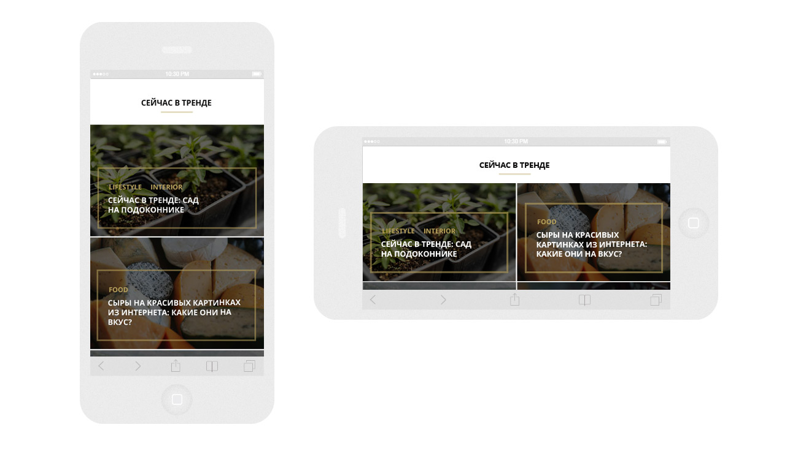

# Требования к 2-ому этапу

## Задание

1. Сверстать макет планшетной версии сайта [./psd/NOEMI_mq_tablet.psd](./psd/NOEMI_mq_tablet.psd)
   в соответствии с требованиями ниже
2. Сверстать макет мобильной версии сайта [./psd/NOEMI_mq_mobile.psd](./psd/NOEMI_mq_mobile.psd)
   в соответствии с требованиями ниже
3. Сверстать всплывающее окно для всех версий сайта

## Требованиям

#### Содержание
- [Требования к 2-ому этапу](#требования-к-2-ому-этапу)
  - [Задание](#задание)
  - [Требованиям](#требованиям)
      - [Содержание](#содержание)
    - [Кроссбраузерная вёрстка](#кроссбраузерная-вёрстка)
    - [Промежуточные состояния между макетами](#промежуточные-состояния-между-макетами)
    - [Состояния при повороте экрана](#состояния-при-повороте-экрана)
    - [Вёрстка всплывающей формы (попап)](#вёрстка-всплывающей-формы-попап)

К требованиям предыдущего этапа добавляются новые

### Кроссбраузерная вёрстка

В рамках проекта свёрстанные макеты должны корректно отображаться на следующих типах устройств:
- компьютерах с операционными системами Windows и Mac OS,
- планшетах и смартфонах с операционной системой iOS,
- планшетах и смартфонах с операционной системой Android.

Кроме поддержки основных типов устройств также требуется, чтобы вёрстка корректно работала в следующих браузерах:
- Последняя версия Mobile Safari,
- Последняя версия Mobile Chrome.

В случае, если у вас нет какого-то устройства или программы, постарайтесь их найти или используйте эмуляторы, встроенные в браузер. Тестирование на реальных устройствах является важным навыком современного специалиста.

### Промежуточные состояния между макетами

Дизайнер подготовил 2 макета отображения страницы для устройств с шириной экрана 768px и 1200px. Но дизайнер не предоставил отображения страницы в промежуточных состояниях, поэтому их нужно реализовать с помощью принципа «Резиновая вёрстка».

Таким образом, на экранах с шириной больше 1200px фоновые блоки будут растягиваться на всю ширину экрана, а их контент будет центрироваться.

На устройствах с шириной экрана от 1200px и более вам нужно реализовать дизайн макета `NOEMI_mq_desktop.psd`.

Для устройств с шириной экрана, попадающей в диапазон от 641px до 1200px, вам нужно реализовать резиновый дизайн макета `NOEMI_mq_tablet.psd`.

### Состояния при повороте экрана

Вёрстка раздела «Сейчас в тренде» должна отличаться при портретной (вертикальной) ориентации экрана и при пейзажной (горизонтальной).

Для устройств с шириной экрана, попадающей в диапазон от 641px до 1200px, при портретной ориентации экрана карточки трендов должны быть выстроены в две колонки, а при пейзажной ориентации — в четыре.

Для устройств с шириной экрана от 640px и меньше, при портретной ориентации экрана должна быть одна колонка с карточками, а при пейзажной — две.

### Вёрстка всплывающей формы (попап)

Каждый макет содержит всплывающую форму на слое `Popup`, этот слой по умолчанию скрыт. Свёрстанная форма должна отображаться по центру экрана, поверх вуали, затемняющей страницу.

**Вам не нужно реализовывать всплытие формы и её скрывание при клике на крестик.** Достаточно, чтобы форма была в разметке и ваш дипломный руководитель мог её найти.

После того, как закончите с вёрсткой всплывающего окна добавьте блоку класс `_hidden` и задайте этому классу свойства, скрывающие блок.